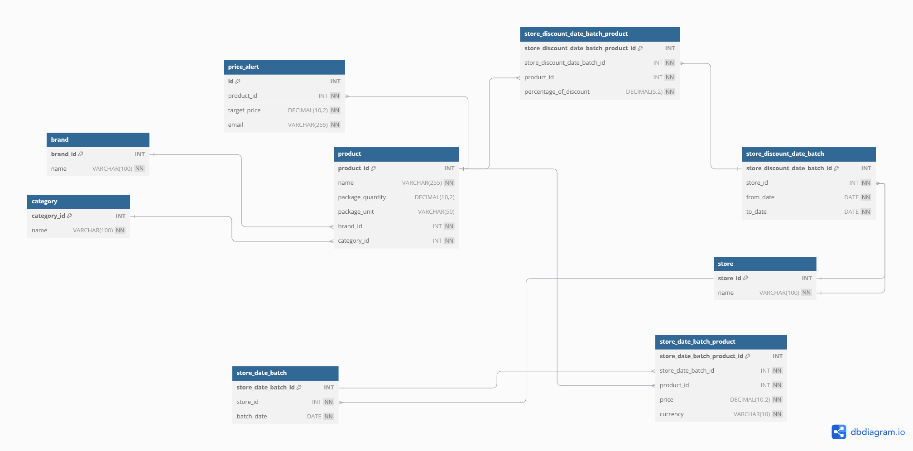

 # Price Comparator - Spring Boot Backend Application


Link to video demonstration: https://youtu.be/ihPRxaxtc8I

## Description

A backend service that helps users compare prices of everyday grocery items
across different supermarket chains (e.g., Lidl, Kaufland, Profi). The system should allow
users to track price changes, find the best deals, and manage their shopping lists
effectively.


## Table of Contents

1. [Backend Design](#1-backend-design)
    - [Application Architecture](#1.1-application-architecture)
    - [Database](#1.2-database)
2. [Build and Run Application](#2-build-and-run-application)
3. [Assumptions / Current limitations](#3-assumptions--current-limitations)
4. [Example Usage](#4-example-of-using-the-application)


## 1. Backend Design

### 1.2. Application Architecture

Every feature of the backend uses this data processing pipeline, and this image is just a theoretical representation.
This diagram shows the main layers of the backend application:
- REST Controller exposes API endpoints
- Service layer contains business logic
- DAO handles DB operations using JPA
- MySQL stores persistent product data


[//]: # (--------------)
### 1.2 Database

The backend uses a MySQL database with the following tables:

#### 1. `product`
Stores product information:
- `product_id` (PK)
- `name`
- `package_quantity`
- `package_unit`
- `brand_id` (references `Brand`)
- `category_id` (references `Category`)


---


---

#### 2. `brand`
Contains a fixed list of shops:
- `brand_id` (PK)
- `name` (e.g., Lidl, Pilos, Zuzu etc.)


---

#### 3. `category`
Stores product category labels:
- `category_id` (PK)
- `name` (e.g., Lactate, Panificatie, Carne, etc.)

---

#### 4. `store`
Stores product category labels:
- `store_id` (PK)
- `name` (e.g., Lidl, Kaufland, Profi  etc.)
  **Initial entries:** 3 shops
---

#### 5. `store_date_batch`
Stores product category labels:
- `store_date_batch_id` (PK)
- `store_id` (references `store`)
- `batch_date` (e.g. `2025-05-01`)
- UNIQUE(store_id, batch_date)
---

#### 6. `store_date_batch_product`
Stores product category labels:
- `store_date_batch_product_id` (PK)
- `store_date_batch_id ` (references table no. 5 - `store_date_batch`)
- `product_id` (references `product`)
- `price`
- `currency`
---

#### 7. `store_discount_date_batch`
Stores product category labels:
- `store_discount_date_batch_id` (PK)
- `store_id ` (references `store`)
- `from_date` (e.g. `2025-05-01`)
- `to_date` (e.g. `2025-05-08`)
- UNIQUE(store_id, from_date, to_date)
---

#### 8. `store_discount_date_batch_product`
Stores product category labels:
- `store_discount_date_batch_product_id` (PK)
- `store_discount_date_batch_id ` (references `store_discount_date_batch`)
- `product_id` (references `product`)
- `percentage_of_discount`

#### 9. `price_alert`
Stores product category labels:
- `id` (PK)
- `product_id ` (references `product`)
- `target_price` 
- `email`

---
### Schema Diagram



### 1.3 Structure of Folders


The backend code is organized into clear, modular packages to follow the separation of concerns principle and to make future extensions easier to implement. Below is an example for each folder:
```text
src/
├── controller/
│   └── BasketOptimizerController.java      # Handles incoming HTTP requests for the optimization of the basket
├── service/
│   ├── database/
│   │   └── ProductService.java             # Business logic related to database entities
│   └── feature/
│       └── BasketQueryService.java         # Logic related to DTO processing and conversion for a feature
├── dao/
│   ├── database/
│   │   └── ProductRepository.java          # Standard repository for database access
│   └── features/
│       └── BasketOptimizerRepository.java  # Custom queries and logic for basket optimization feature
├── dto/
│   └── ProductPriceDTO.java                # Data Transfer Object used as the smallest building block in a response
└── entity/
    └── Product.java                        # Entity class mapped to the database
```


The `test` folder mirrors the structure of the `src` folder to ensure clear separation between implementation and testing. Each component has corresponding tests in the `test` folder, organized as follows:

The `/test/controller` folder contains integration tests that build the full application and interact with the **real database**.  
Ensure the database is properly configured and accessible before running these tests.


```declarative
src/
└── test/
    ├── controller/
    │   └── BasketOptimizerControllerTest.java      # Integration tests for endpoint that is managed by BasketOptimizerController 
    ├── service/
    │   ├── database/
    │   │   └── ProductServiceTest.java             # Unit tests for ProductService
    │   └── feature/
    │       └── BasketQueryServiceTest.java         # Unit tests for  BasketQueryService
    ├── dao/
    │   ├── database/
    │   │   └── ProductRepositoryTest.java          # Unit tests for ProductRepository
    │   └── features/
    │       └── BasketOptimizerRepositoryTest.java  # Unit tests for BasketOptimizerRepository
    ├── dto/
    │   └── ProductPriceDTOTest.java                # Unit tests for ProductPriceDTO 
    └── entity/
        └── ProductTest.java                        # Unit tests for entity - Product 
```


## 2. Build and Run Application
## 2.1 Requirements
- **Java 17** installed and configured in your system.
- **MySQL Server** running on port `3306`.
- A MySQL user with the following credentials:
    - **Username**: `springstudent`
    - **Password**: `springstudent`
- A database named **PRODUCT_DATABASE** must exist before running the application.  
  This is where all tables and data will be created and stored.
- You need to update the `application.properties` file with your own email address and app-specific password for the price alert configuration.

## 3. Assumptions / Current limitations:
- THE CSV FILES for discounts and prices are not duplicated: they had correct naming and there is no duplicated data.
- For simplicity, the service assumes that the products sent in the request are written exactly as they appear in the database.
  For example, "lapte zuzu" must match the product name exactly.
  In a real application, users will select products from predefined lists, so this limitation does not affect the final user experience.
- The currency is not specified in most of the functionalities, considering that all the data is currently in RON


**Mention**: These assumptions were made because I focused on implementing the core functionalities and did not test every edge case due to the limited 2-week development time.


## 4. Example of Using the Application

To use this application, follow the steps below:

### 4.1. Download the Application
Clone the repository to your local machine using Git:
```
git clone git@github.com:MarianVJ/priceComparatorBackend.git
```

### 4.2 Build the Application
To build the application, use the following Maven wrapper command:
```
./mvnw clean package
```


### 4.3 Run the application
This will start the Spring Boot application. By default, it should be accessible at `http://localhost:8080`.
```
./mvnw spring-boot:run
```
### 4.4 Features

Each feature has its own classes for Controller, Service, and Repository. This decision was made considering the possibility of extending the features with more complex or additional functionality.

#### Detail

A product can have different prices based on date_batch
For example. For a store:

- It can have a price on `2025-05-01` - Price_1
- It can have a price on `2025-05-08` - Price_2

- It can have a discount that is in period `2025-05-02 - 2025-05-07` , with discount_percentege_1
- It can have a discount that is in period `2025-05-11 - 2025-05-13`, with discount_percentege_2

For this example , there will be  5 prices based on time:
1. on 2025-05-01 - Price_1
2. on 2025-05-03 - Price_1 but reduced with discount_percentege_1
3. on 2025-05-08 - Price_2
4. on 2025-05-11 - Price_2 but reduced with discount_percentege_2

⚠️**All implemented features and the entire backend are based on this logic.**


### 4.4.1 Daily Shopping Basket Monitoring

Help users split their basket into shopping lists that optimise for cost savings.


#### Usage


**Request Example:**  
`POST http://localhost:8080/rest/basket-optimizer/optimize`

Request body:
```json

  {
    "date": "2025-05-13",
    "products": ["lapte zuzu", "cafea măcinată", "iaurt grecesc", "apa de izvor"]
  }

```

*Response Example:*
```json
[
  {
    "recommendedShopping": {
      "lidl": [
        {
          "name": "cafea măcinată",
          "price": 19.21
        },
        {
          "name": "lapte zuzu",
          "price": 8.62
        }
      ],
      "profi": [
        {
          "name": "iaurt grecesc",
          "price": 10.37
        }
      ]
    },
    "storeTotals": {
      "lidl": 27.83,
      "profi": 10.37
    },
    "basketTotal": 38.199999999999996,
    "notes": [
      "Product not found: apa de izvor"
    ]
  }
]
```

#### Implementation Details

The following components are used in the backend implementation, each located in their respective package:

- `rest/BasketOptimizerController` – processes the requests for the `rest/basket-optimizer/optimize` endpoint.
- `service/features/BasketQueryService` – applies the business logic (how the `BasketOptimizationResponse` is built).
- `dao/features/BasketQueryRepository` – accesses the database and performs the query using native SQL syntax for operation optimization (uses a query with `ROW_NUMBER()`).
- `dto/ProductDTO` – used for sending data in the response (smallest building block).


### 4.4.2 Best Discounts:

List products with the highest current percentage discounts across all tracked
stores.


#### Feature Detail

The feature allows querying the best available discounts for a specific date, which can be provided in the request body.
By default, it returns the top 10 highest discounts available on that date

**Request Example:**  
`POST http://localhost:8080/rest/best-discounts/on-date`

Request body:
```json
{
  "date": "2025-05-09"
}
```


*Response Example:*
```json
[
  {
    "name": "spaghetti nr.5",
    "discount": 20.0,
    "brand": "Barilla",
    "store": "lidl",
    "currency": "RON",
    "price_without_discount": 5.7
  },
  {
    "name": "detergent lichid",
    "discount": 20.0,
    "brand": "Persil",
    "store": "lidl",
    "currency": "RON",
    "price_without_discount": 49.5
  },
  {
    "name": "spaghetti nr.5",
    "discount": 18.0,
    "brand": "Barilla",
    "store": "kaufland",
    "currency": "RON",
    "price_without_discount": 5.85
  },
  {
    "name": "detergent lichid",
    "discount": 18.0,
    "brand": "Dero",
    "store": "profi",
    "currency": "RON",
    "price_without_discount": 48.9
  },
..........
]
```


#### Implementation Details

The following components are used in the backend implementation, each located in their respective package:

- `rest/BestPercentageDiscountsController` – processes the requests for the `/rest/best-discounts/on-date` endpoint.
- `service/features/BestPercentageDiscountsService` – applies the business logic 
- `dao/features/BestPercentageDiscountsRepository` – accesses the database and performs the query using native SQL syntax for operation optimization
  - When multiple discounts apply on the queried date, the discount that began most recently overrides the others.
- `dto/ProductDiscountPercentageDto` – used for sending data in the response (smallest building block).


### 4.4.3 New Discounts:

List discounts that have been newly added (e.g., within the last 24 hours).

**Request Example:**  
  `POST http://localhost:8080/rest/latest-discounts/on-date`

Request body:
```json
{
  "date": "2025-05-09"
}
```

*Response Example:*
```json
[
  {
    "name": "lapte zuzu",
    "discount": 9.0,
    "brand": "Zuzu",
    "store": "kaufland",
    "currency": "RON",
    "price_without_discount": 10.0
  },
  {
    "name": "ouă mărimea M",
    "discount": 11.0,
    "brand": "Ferma Veche",
    "store": "kaufland",
    "currency": "RON",
    "price_without_discount": 13.6
  },
  {
    "name": "ulei floarea-soarelui",
    "discount": 8.0,
    "brand": "Floriol",
    "store": "kaufland",
    "currency": "RON",
    "price_without_discount": 9.6
  },
  {
    "name": "hârtie igienică 3 straturi",
    "discount": 13.0,
    "brand": "Pufina",
    "store": "kaufland",
    "currency": "RON",
    "price_without_discount": 19.3
  },
  {
..........
]
```

#### Implementation Details

The following components are used in the backend implementation, each located in their respective package:

- `rest/LatestDiscountsController` – processes the requests for the `/rest/latest-discounts/on-date` endpoint.
- `service/features/LatestDiscountsService` – applies the business logic
- `dao/features/LatestDiscountsRepository` – accesses the database and performs the query using native SQL syntax for operation optimization
    - The query searches for the discounts that has the value for from_date equal to provided date , or that is the previous dat

- `dto/ProductDiscountPercentageDto` – used for sending data in the response (smallest building block).


### 4.4.4 Dynamic Price History Graphs:
- Provide data points that would allow a frontend to calculate and display price
trends over time for individual products.

- This data should be filterable by product category, or brand.

  (The same steps and pattern is for the /brand/{brandName})


*Request Example 1:*  
- Template: `GET http://localhost:8080/rest/dynamic-price-history/category/{categoryName}`

- Effective: `GET http://localhost:8080/rest/dynamic-price-history/category/lactate`


*Response Example:*
```json
[
  {
    "productName": "brânză telemea",
    "productBrand": "Hochland",
    "store": "kaufland",
    "dataPoints": [
      {
        "date": "2025-05-01",
        "price": 11.79
      },
      {
        "date": "2025-05-08",
        "price": 13.0
      }
    ]
  },
  {
    "productName": "brânză telemea",
    "productBrand": "Pilos",
    "store": "lidl",
    "dataPoints": [
      {
        "date": "2025-05-01",
        "price": 10.88
      },
      {
        "date": "2025-05-08",
        "price": 11.61
      },
      {
        "date": "2025-05-15",
        "price": 12.9
      }
    ]
  },
  {
    "productName": "brânză telemea",
    "productBrand": "Pilos",
    "store": "profi",
    "dataPoints": [
      {
        "date": "2025-05-01",
        "price": 12.8
      }
    ]
  },
..........
]
```

#### Implementation Details

The following components are used in the backend implementation, each located in their respective package:

- `rest/DynamicPriceHistoryController` – processes the requests for the `/rest/latest-discounts/on-date` endpoint.
- `service/features/dynamicPriceHistoryService` – applies the business logic
- `dao/features/dynamicPriceHistoryRepository` – accesses the database and performs the query using native SQL syntax for operation optimization
  - The same logic applies as described in the database model: a product retains the price from its most recent `batch_date` up to the current date.
  - If a discount is active, the price is adjusted based on the most recent batch available at the start of the discount period, reflecting the product’s price evolution over time.
- `dto/ProductPriceHistoryDto` – used for sending data in the response (smallest building block).


### 4.4.5 Best Product Deals ( Product Substitutes & Recommendations ):

Highlight "value per unit" (e.g., price per kg, price per liter) to help identify the
best buys, even if the pack size differs


#### Usage

**Request Example:**  
`POST http://localhost:8080/rest/best-deals/on-date`

Request body:
```json
{
  "date": "2025-05-09"
}
```

*Response Example:*
```json
[
  {
    "name": "ouă mărimea M",
    "brand": "Din Ogradă",
    "store": "profi",
    "packageQuantity": 10.0,
    "packageUnit": "buc",
    "valuePerUnit": 1.125,
    "currency": "RON",
    "final_price": 11.25
  },
  {
    "name": "ouă mărimea M",
    "brand": "Ferma Veche",
    "store": "kaufland",
    "packageQuantity": 10.0,
    "packageUnit": "buc",
    "valuePerUnit": 1.2104,
    "currency": "RON",
    "final_price": 12.1
  },
  {
    "name": "ouă mărimea M",
    "brand": "Lidl",
    "store": "profi",
    "packageQuantity": 10.0,
    "packageUnit": "buc",
    "valuePerUnit": 1.22,
    "currency": "RON",
    "final_price": 12.2
  },
  {
    "name": "ouă mărimea M",
    "brand": "Lidl",
    "store": "profi",
    "packageQuantity": 10.0,
    "packageUnit": "buc",
    "valuePerUnit": 1.22,
    "currency": "RON",
    "final_price": 12.2
  },
..........
]
```


#### Implementation Details

The following components are used in the backend implementation, each located in their respective package:

- `rest/BestBuysPerUnitController` – processes the requests for the `/rest/best-deals/on-date` endpoint.
- `service/features/BestBuysPerUnitService` – applies the business logic
- `dao/features/BestBuysPerUnitRepository` – accesses the database and performs the query using native SQL syntax for operation optimization
    - The query:
      - - Applies the **discount** available at the provided date, if applicable.
        - **Converts units** for consistency:
          - Products measured in **ml** are converted to **liters (l)**.
          - Products measured in **mg** are converted to **kilograms (kg)**.
- `dto/BestDealsProductDto` – used for sending data in the response (smallest building block).


### 4.4.6 Custom Price Alert :

Allow users to set a target price for a product. The system should be able to
identify when a product's price drops to or below that target


#### Usage

**Request Example:**  
`POST http://localhost:8080/rest/configure-price-alert/on-product`

Request body:
```json
{
  "productName": "cartofi albi",
  "productBrand": "Generic",
  "targetPrice": 2.5,
  "email": "jorascuvlad@gmail.com"
}
```


#### Implementation Details

The following components are used in the backend implementation, each located in their respective package:

- `rest/CustomPriceAlertController` – processes the requests for the `/rest/best-deals/on-date` endpoint.
- `service/features/BestBuysPerUnitService` – applies the business logic
- `dao/features/BestBuysPerUnitRepository` – accesses the database and performs the query using native SQL syntax for operation optimization


- `PriceAlertSchedulerService` - a service that runs the business logic periodically (every 5 minutes or once per day). It checks if any price alert conditions are met, and if so, notifies the user via email.
- `EmailService` - a service for sending the email for PriceAlarm


- `dto/PriceAlertRequestDto ` – DTO used for deserializing request payloads
- `entity/PriceAlert` - Entity class used for storing in database the details about the price alert


## Future Improvements ()


- Refactor the duplicated code from the class DynamicPriceHistoryRepositoryImpl. Each of the two queries has almost the same logic; the only difference is how data is filtered — by category or by brand.

- Write more unit tests.

- Possibly, consider redesigning/refactoring the way data is stored (i.e. the table design), in order to have less verbose queries — with the trade-off of slightly increased memory usage.

- Extend the database to include a greater variety of products, shops, and a longer time period of price variations.